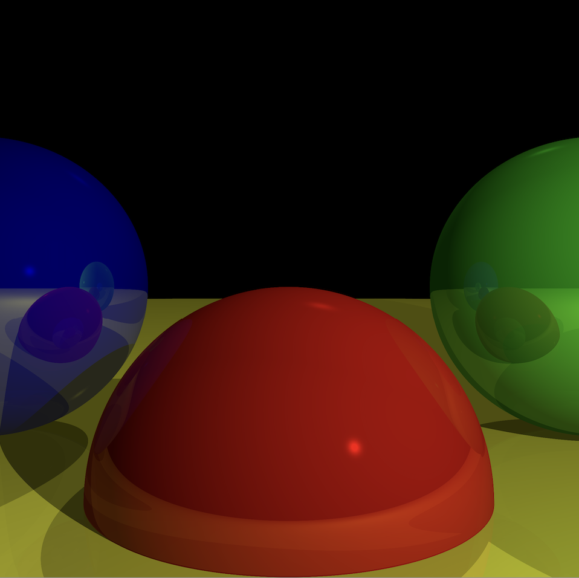

# Simple C++ Raytracer 🟥🟩🟦
This is a simple raytracer made from scratch in C++. This repository is meant as a place to keep track of the changes made to the engine, as there are a lot of things that are planned to be added.



## Implemented Features
The capabilities of the engine thus far.

- Raytracing engine that renders images in Portable PixMap format (PPM).
- Rendering of spheres and planes.
- Light sources.
- Specular and Diffused reflection.
- Full reflections with adjustable recursion depth.
- Full rotation and posistioning of camera.
- Shadows.
- Supersampling anti-aliasing.

## Future Features
These features, in no particular order, are some of the improvements that I wish to implement to the engine.

- [x] Improved memory managment for scalability
- [x] Cache storage of recurring calculations.
- [x] Refraction.
- [x] Transparent objects.
- [ ] Shadow-rendering optimization.
- [ ] Bounding Volume Hierarchies.
- [ ] Options for subsampling.
- [ ] More primitive shapes (triangle, pyramid, cone, square, etc.)
- [ ] Complex shapes (i.e.: sphere with hole cut into it).
- [ ] Parrallelism
- [ ] CLI for user-friendly rendering of scenes.

## Long-Term Goals
Eventually, I wish to use my engine to render a space in real time, and have it run rudementary simulations, though this currently lies beyond the scope of the engine.

## Running
There are plans to make a CMake installation of this engine, but in the mean time, the only way to compile and render scenes is to modify the `raytracing.cpp` file and compiling it with the compiler of
your choice (GNU's gcc is recommended).   

Example:
```bash
g++ raytracer.cpp ./animations/*.cpp -o exec && ./exec
```
Note that compiling the header implementations is required.  

## Acknowledgements
This project was originally made for the Computer Graphics course in my university. Some essential components, like trace ray calculations, were provided in part or in full by my professor and/or
materials provided in said course.
